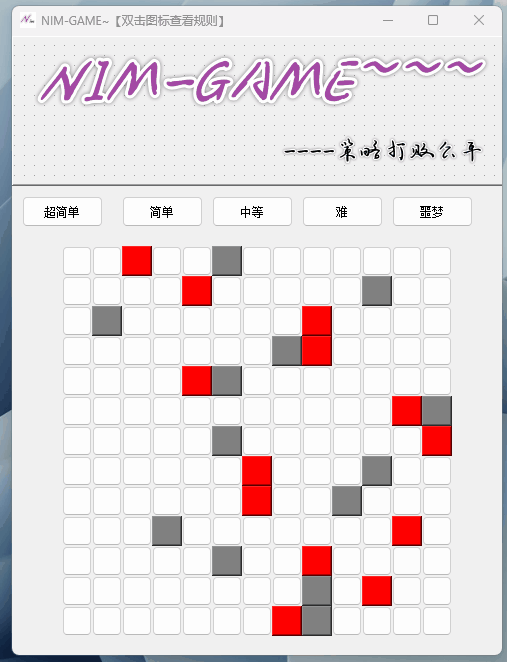
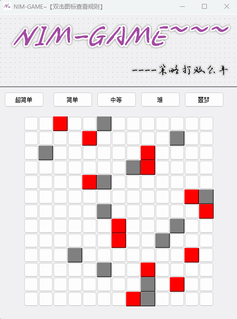
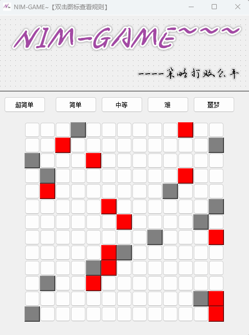
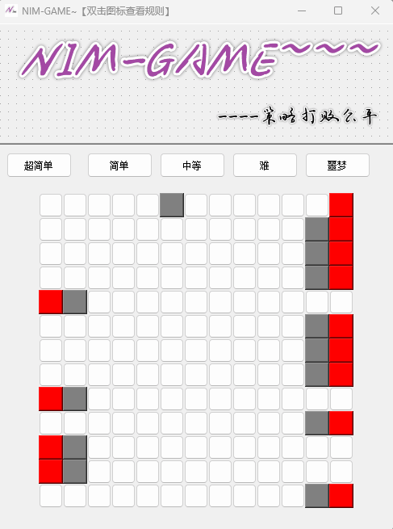
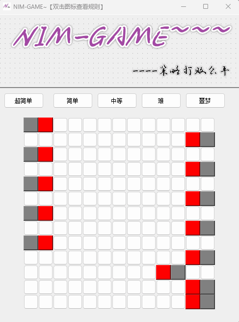

# NimGameShowByQT

## 实机演示

### 显示规则

### 选择难度

### 移动

### 获得胜利

### 输掉比赛

## 项目思路

为了方便描述, 我们重新解释下面的几个变量

* 第 $i$ 行的红色的棋子 :   $R_i$
* 第 $i$ 行的灰色的棋子 :   $G_i$
* $R_i$ 和 $G_i$ 之间的距离 $a_i$

一个显而易见的结论是, 如果是玩家使所有行的红色棋子和灰色棋子贴在一起, 即 $\sum\limits_{i = 0}^n a_i = 0$

那么玩家就一定会输

所以我们如果想要赢得游戏, 就需要电脑将所有行的红色棋子和灰色棋子贴在一起

我们将 $a_i$ 看成石子, 那么问题再次转化为要让电脑最后一步将石头全部拿走

至此, 我们就可以得到必胜的条件 :

如果 :
$$
a_1 \oplus a_2 \oplus a_3 \oplus \dots \oplus a_n = 0
$$
那么电脑必胜,  否则玩家必胜

